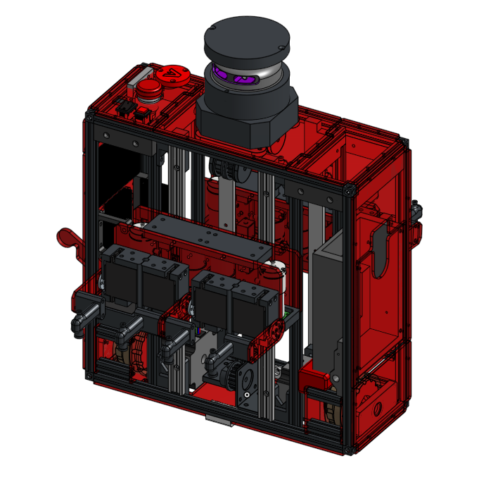
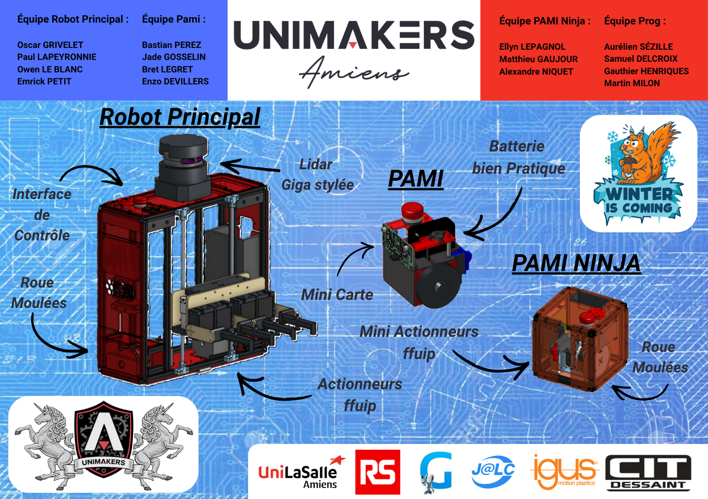

# Documentation Unimakers : Coupe de France de Robotique 2026

Ce site regroupe toute les informations à propos de la réalisation du Robot principal et des PAMI de la coupe de France de Robotique par les premières années.

[Notre projet Onshape](https://cad.onshape.com/documents/5b95f7d41002d84546ec6a71/w/4d12e92d5e6caf64c727cbc9/e/ff990b5b5ecc051d8c3d9b93){: .btn .btn-green .fs-5 .mb-4 .mb-md-0 }
[Notre repository GitHub](https://github.com/Makerspace-Amiens/template-project){: .btn .btn-primary .fs-5 .mb-4 .mb-md-0 }

## À propos du Projet

En vue de la participation d'Unimakers à la coupe de France de Robotique, les membres de première année ont participé à la réalisation d'un robot "principal" équipé d'actionneurs, ainsi que la conception de robots "PAMI" (Petit Actionneur Mobile Indépendant).

Le thème de cette édition 2026 était "Winter is Coming" (L'hiver arrive). Dans ce mode de jeux, le robot principal devait effectuer plusieurs tâches :
* Déplacer des planchettes en bois bicolors, et si possible les retourner couleur de l'équipe face visible
* Déplacer un curseur le long de la parois jusqu'au millieu d'un termomètre

Côté PAMI, il,y en avait deux types :
* Les PAMI classiques, qui doivent se déplacer vers les point de dépots de planchettes avant d'enclancher son actioneur (remuer la queue par exemple)
* Le PAMI "ninja" sur un espace dédié qui doit déplacer des planchettes se son côté

Pour plus de détails, nous vous invitons à <a href="https://unimakers.fr/CDR2026-DOC-Equipe-I1/images/Eurobot2026_Rules_1.0_FR.pdf" download>télécharger le règlement de l'édition 2026 : Winter is Coming</a>

## Poster

## Vidéo de présentation

<video src="images/CDR 2026_480p.mp4" controls title="Title"  style="width: 100%;"></video>

---
